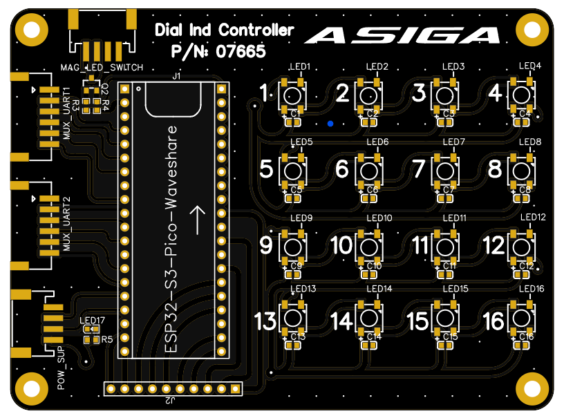
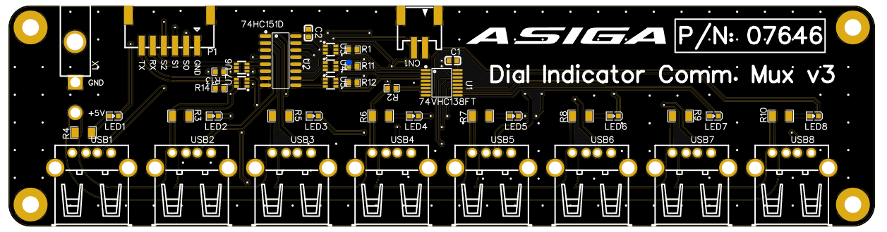
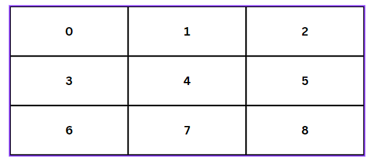
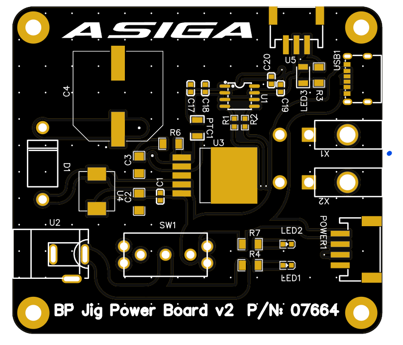

# platform-parallelism
Asiga build platform QC machine, testing parallelism and height spec.

Raspberry Pi 4 Account Details:
Username: **zydex-engineering**
Password: **2024**

If window is closed, program can be rerun with BP-JIG icon on desktop or navigating to `~/Documents/parallelism-profile-qc/qt-platform-parallelism` and running `python3 main.py`.

---

# Electronics
## Controller (PN07665)

Hosts ESP32-S3 MCU board, selects and gets data from all dial indicators, forwards through to USB serial. Sends signals for driving electromagnet and magnet LED. Code written in ESP-IDF framework, developed on PlatformIO. Uses FreeRTOS threads for getting data from MUX boards and forwards data on respective UART lines. Note: MCU board and PCB GND are not connected. Tie together externally during assembly. Retrieves data in millimeters (3dp). Grid array of addressable LEDs correspond to each USB port on the mux board, detecting whether a micrometer is successfully connected.

- Schematic -> PN07665 EasyEDA design files/Controller
- PCB design -> PN07665 EasyEDA design files/PCB_Controller

### Components
|            Ref            |                                                  Part                                                   |                   Note                   |
| :-----------------------: | :-----------------------------------------------------------------------------------------------------: | :--------------------------------------: |
|            J1             | [ESP32-S3 Waveshare Pico](https://www.waveshare.com/wiki/ESP32-S3_Waveshare_Pico_MCU_Development_Board) |                   MCU                    |
|          LED1-16          |                         [COM-16347](https://www.digikey.com.au/short/n90nzttf)                          |         WS2812B Addressable LED          |
|           C1-16           |                                Generic 0603 16V 0.1uF ceramic capacitor                                 |          Decoupling capacitors           |
|            Q2             |                        [BSS84AK,215](https://www.digikey.com.au/short/h07v5d89)                         |         MOSFET for switching LED         |
|            R3             |                                     Generic 0603 4.7K Ohm Resistor                                      |         MOSFET Pull-up resistor          |
|          R4, R5           |                                      Generic 0603 120 Ohm Resistor                                      |    MOSFET gate resistor, LED resistor    |
|           LED17           |                                       Generic 20mA Green 0603 LED                                       |               5V power LED               |
| MAG_LED_SWITCH, POWER_SUP |                       [S4B-PH-SM4-TB](https://www.digikey.com.au/short/mfrmz3ch)                        | 4-pin JST-SPH right angle SMD receptacle |
|   MUX_UART1 & MUX_UART2   |                       [S6B-PH-SM4-TB](https://www.digikey.com.au/short/5wcvq9v4)                        | 6-pin JST-SPH right angle SMD receptacle |

### GPIO pin assignments
|    GPIO    |                 Detail                 |   IO Type    |
| :--------: | :------------------------------------: | :----------: |
|   17, 16   |              UART 1 TX/RX              | OUTPUT/INPUT |
|   36, 35   |              UART 2 TX/RX              | OUTPUT/INPUT |
| 13, 14, 15 | SELECT lines for MUX board 1 (A, B, C) |    OUTPUT    |
| 18, 33, 34 | SELECT lines for MUX board 2 (A, B, C) |    OUTPUT    |
|     11     |        Electromagnet button pin        |    INPUTB    |
|     12     |         Electromagnet LED pin          |    OUTPUT    |
|   37, 38   |      Electromagnet control (F, R)      |    OUTPUT    |
|   10, 9    |        LED strip data in (1, 2)        |    OUTPUT    |
___
## MUX board (PN07646)

Micrometers had very minimal documentation and functionality. Only continued to work with them as we had plenty of them available, cheap and fast to get. RS232 serial communication but no flow control RTS/CTS lines, only TX/RX in a USB-C 

Software that shipped with micrometers:
- Handles one micrometer at a time
- Convoluted GUI
- Windows exe app only
- No additional functionality

Micrometers have an internal battery that needs to be charged. 4 or 8 way RS232 hubs that have power input and data lines MUXed into 1 usb port are $500+, and their power supply max I found was 12V @ 3A. Each micrometer when charging draws at peak 600mA. MUX 4 micrometers at peak draw 2.4A, 8 micrometers at peak draw 4.8A. Going with hubs also increases the size of the electronics substantially. Additionally, power resetting hub messes up the ordering of the micrometers on the jig, requiring manual re-ordering of the data channels on the computer. Custom boards and firmware made to circumvent these issues such that unplugging micrometers to charge is eliminated, and the ordering of the micrometers on the jig is maintained even with power reset.

Do not place C1. Incorrect +5V. Bridge cap pads.

- Schematic -> PN07646 EasyEDA design files/USB2_ExpansionBoardv3
- PCB design -> PN07646 EasyEDA design files/PCB_USB2_ExpansionBoardv3

2 MUX boards used. Connect P1 of MUX1 -> MUX_UART1, P1 of MUX2 -> MUX_UART2.

### Components
|     Ref      |                                 Part                                 |                     Note                      |
| :----------: | :------------------------------------------------------------------: | :-------------------------------------------: |
|    USB1-8    |       [CU01SAH0S00](https://www.digikey.com.au/short/2h84r3pz)       |              USB 2.0 Receptacle               |
|      X1      | [MOLEX MINI-FIT JR_2P_2R](https://www.digikey.com.au/short/5jq5b59m) |     MOLEX MINI-FIT JR_2P_2R - RIGHT ANGLE     |
|    C1, C2    |               Generic 0603 16V 0.1uF ceramic capacitor               |             Decoupling capacitors             |
| R1-3, R11-14 |                    Generic 0603 4.7K Ohm Resistor                    | Pull-up resistors for level shifters, decoder |
|    R4-10     |                    Generic 1206 120 Ohm Resistor                     |                 LED resistors                 |
|    LED1-8    |                     Generic 20mA Green 0603 LED                      |                 5V power LED                  |
|     CN1      |      [S2B-PH-SM4-TB](https://www.digikey.com.au/short/r17mvb0n)      |   2-pin JST-SPH right angle SMD receptacle    |
|      P1      |      [S6B-PH-SM4-TB](https://www.digikey.com.au/short/5wcvq9v4)      |   6-pin JST-SPH right angle SMD receptacle    |
|      U1      |       [74VHC138FT](https://www.digikey.com.au/short/pdnzwj9w)        |          IC DECODER 1 X 3:8 16TSSOP           |
|      U2      |        [74HC151D](https://www.digikey.com.au/short/cz925ppn)         |          IC MULTIPLEXER 1 X 8:1 16SO          |

### Micrometer MUX port assignments
| MUX # | Port Num (L->R) | Micrometer Number |
| :---: | :-------------: | :---------------: |
|   1   |        0        |        DNC        |
|   1   |        1        |         0         |
|   1   |        2        |         1         |
|   1   |        3        |        DNC        |
|   1   |        4        |         2         |
|   1   |        5        |         3         |
|   1   |        6        |         4         |
|   1   |        7        |        DNC        |
|   2   |        0        |        DNC        |
|   2   |        1        |         5         |
|   2   |        2        |         6         |
|   2   |        3        |        DNC        |
|   2   |        4        |         7         |
|   2   |        5        |         8         |
|   2   |        6        |        DNC        |
|   2   |        7        |        DNC        |

### Layout of Micrometer on Jig

## Power supply + Electromagnet Driver (PN07664)

Supplies 5V power via USB-C cable to Raspberry Pi 4, Minifit Molex to MUX boards, SM4 JST-PH to controller board. Steps up voltage to 12V for electromagnet drive, and hosts magnet IC. Control lines input from SM4 controller cable. Output to electromagnet port at SM3 JST-PH. RED - board power, RED + GREEN, power to all. 

- Schematic -> PN07664 EasyEDA design files/
- PCB design -> PN07664 EasyEDA design files/

### Components
|   Ref    |                                 Part                                 |                   Note                   |
| :------: | :------------------------------------------------------------------: | :--------------------------------------: |
|    U1    |       [BD6231F-E2](https://www.digikey.com.au/short/rnv2cvt2)        |    Motor Driver IC for electromagnet     |
|    U2    |               Generic 2.1mm DC barrel jack receptacle                |                 Power In                 |
|    U3    |     [LM2585S-12/NOPB](https://www.digikey.com.au/short/58dfmd8b)     |    Fixed 12V Boost buck converter IC     |
|    U4    |  [ASPI-0630LR-150M-T15](https://www.digikey.com.au/short/b3nn4mmf)   |       Boost buck inductor 15uH 3A        |
|   SW1    |      [300SP1J3VS2QE](https://www.digikey.com.au/short/b223whj2)      |        SWITCH ROCKER SPDT 5A 120V        |
|  R4, R7  |                    Generic 1206 120 Ohm Resistor                     |              LED resistors               |
|   LED1   |                     Generic 20mA Green 0603 LED                      |               5V power LED               |
|   LED2   |                      Generic 20mA Red 0603 LED                       |               5V power LED               |
|  POWER1  |      [S4B-PH-SM4-TB](https://www.digikey.com.au/short/mfrmz3ch)      | 4-pin JST-SPH right angle SMD receptacle |
|  X1, X2  | [MOLEX MINI-FIT JR_2P_2R](https://www.digikey.com.au/short/5jq5b59m) |  MOLEX MINI-FIT JR_2P_2R - RIGHT ANGLE   |
|    C1    |               Generic 0603 16V 0.1uF ceramic capacitor               |          Decoupling capacitors           |
|    C2    |               Generic 1206 16V 100uF Ceramic capacitor               |                 Buffers                  |
|    C3    |              Generic 1206 16V 0.47uF Ceramic capacitor               |                                          |
|    C4    |      [EEEFK1V152AM](https://www.digikey.com.au/short/n99d3hvm)       |              Boost buck cap              |
|    D1    |         [1N5820G](https://www.digikey.com.au/short/c3c8384v)         |       Schottky Diode 20V 3A Axial        |
|    R6    |                     Generic 1206 3K Ohm Resistor                     |           Boost buck resistor            |
|   PTC1   |      [0ZCJ0050AF2E](https://www.digikey.com.au/short/rwpct024)       |        Boost buck resettable fuse        |
|   C17    |               Generic 0603 16V 10uF Ceramic capacitor                |                 Buffers                  |
|   C18    |               Generic 0603 16V 220nF Ceramic capacitor               |                Decoupling                |
| C19, C20 |               Generic 0603 16V 220pF Ceramic capacitor               |                 Buffers                  |
|  R1, R2  |                     Generic 1206 1K Ohm Resistor                     |             Power Reduction              |
|   LED3   |      [XZMDKDGK55W-4](https://www.digikey.com.au/short/w8tf8w9b)      |            Bidirectional LED             |
|    R3    |                    Generic 1206 300 Ohm Resistor                     |        Bidirectional LED resistor        |
|   USB1   |      [USB4125-GF-A](https://www.digikey.com.au/short/vfnb38qt)       |           USB-C 2.0 Receptacle           |
|    U5    |      [S3B-PH-SM4-TB](https://www.digikey.com.au/short/nqz35qvr)      |   3-way SPH right angle SMD receptacle   |
