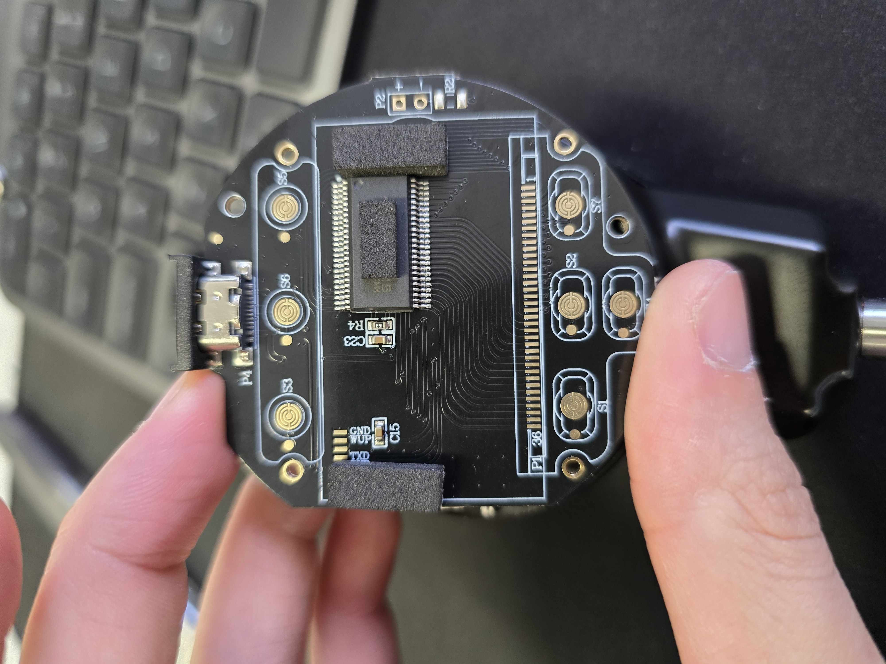
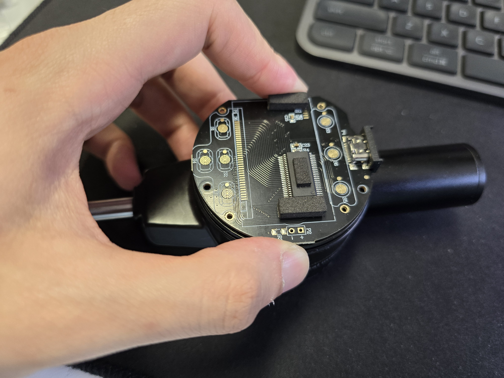
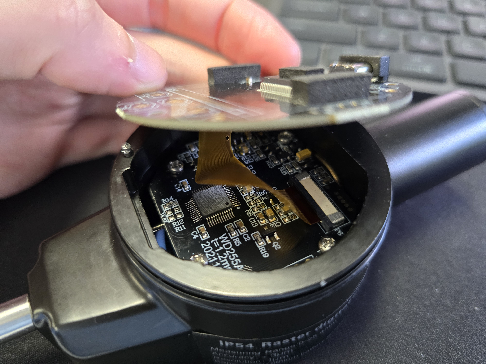
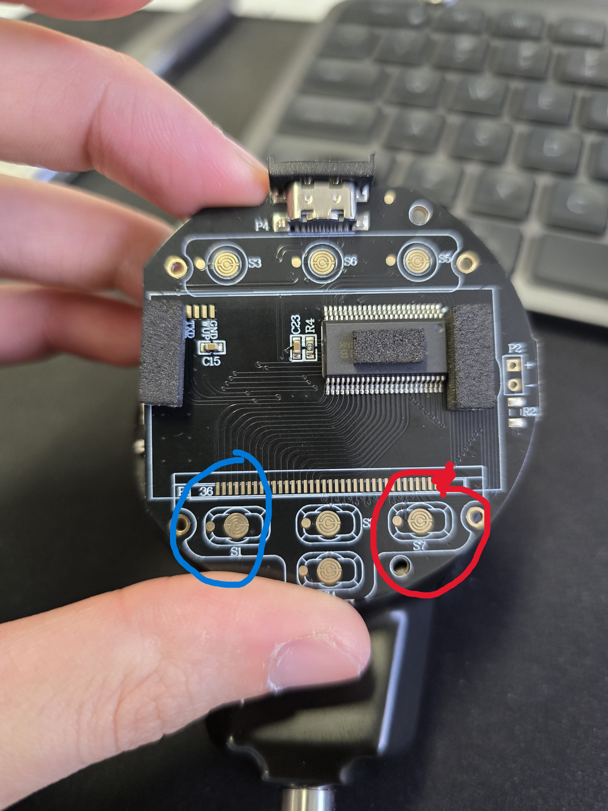
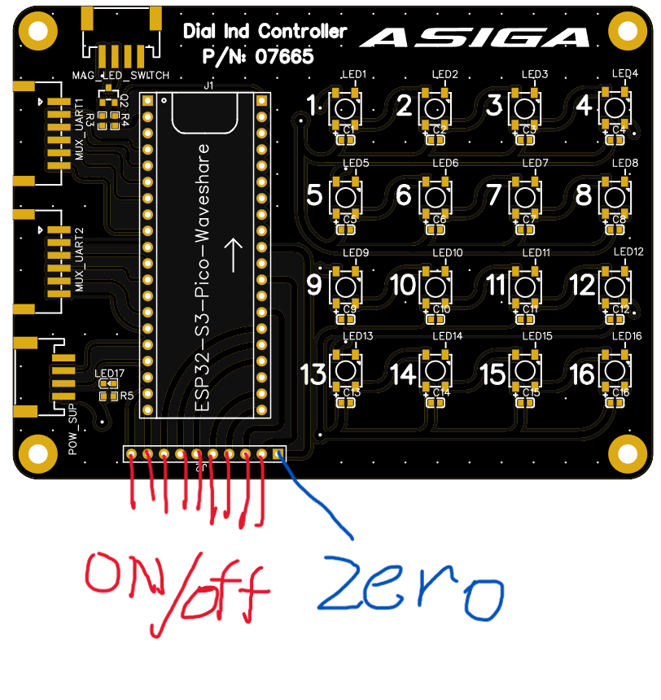

# Suggested Micrometer Modifications for further automating BP Jig

Gabriel Thien @ Asiga August 2024

### Rationale
Indicators should be automatically managed by the jig software or with easily accessible controls would eliminate operator error. Current build platform jig requires the operator to turn on each micrometer individually (and keep them on if they time out). At the start of each day, the jig needs to be calibrated by zeroing the indicators on the golden sample with the electromagnet on. This is a time consuming, precise process that introduces potential operator error (and thus measurement error) if not correctly operated. Micrometers screen buttons are mounted in locations with poor access to their interface buttons. 

### Findings & Thoughts
- Buttons have exposed trace pads on PCB just underneath silicone
- Buttons are ACTIVE LOW (short with GND plane)

- Display is sandwhiched and connected elastomerically to exposed pads on PCB, essentially thin vertical conductors.
- Silicone buttons also function as a bracket for positioning the elastomeric conductor correctly.

- Tradeoff between reusing the micromter for future applications and software controlling the micrometer.
- Will need a custom printed face mount to hold the top PCB and USB port

- Micrometer replacements on the jig won't be simple as swapping them out. Need to remove face, attach wires, seal back up with a custom printed face (measuring sensor is optical, light sensitive).

### Suggested modifications
- Remove face, screen, rubber & silicone (x9)
- External wire to ON/OFF button trace (x9) (S7)
- External wire to ZERO button trace (x9) (S1)

- Custom printed face mount for pcb with through holes for wires and usb port, seals up micrometer from light.
- Tie ON/OFF wire to MCU GPIO (x9) (Use pins on controller board)
- Tie all ZERO wires together onto 1 MCU GPIO (Use pins on controller board)

